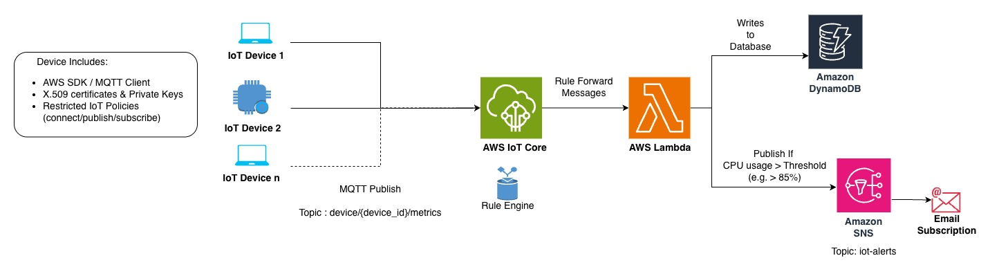

# Building a Scalable IoT Device Monitoring System using AWS CDK

A complete, end-to-end **IoT Device Monitoring system** built using **AWS IoT Core, AWS Lambda, DynamoDB, and SNS**, with **secure MQTT (mTLS)** device communication and **Infrastructure as Code** powered by **AWS CDK v2 (TypeScript)**.

This project demonstrates how real-world IoT platforms are designed — from **device identity and security** to **event-driven processing and alerting** — without relying on the AWS Management Console.

---

## 🧠 Architecture Overview



**Device → AWS IoT Core → IoT Rule → Lambda → DynamoDB → SNS**

- Devices authenticate using **X.509 certificates** and publish telemetry over MQTT
- AWS IoT Core securely ingests and routes messages
- Lambda processes data in real time
- DynamoDB stores telemetry reliably
- SNS sends alerts when thresholds are breached

---

## ✨ Key Features

- 🔐 Secure device authentication using **X.509 certificates (mTLS)**
- 📦 Scalable device creation using **AWS CDK loops**
- ⚙️ Event-driven backend using **IoT Rules + Lambda**
- 🗄️ Time-series data storage with **DynamoDB**
- 🚨 Real-time alerts via **SNS Email notifications**
- 🧱 Fully defined using **AWS CDK v2 (TypeScript)**

---

## 🗂️ Project Structure

```
.
├── bin/
│   └── infra.ts                # CDK app entry point
├── lib/
│   ├── iot-core-stack.ts       # IoT Things, Certificates, Policies
│   └── infra-stack.ts          # Lambda, DynamoDB, SNS, IAM
├── lambda/
│   └── device_health.py        # Lambda function logic
├── certificates/
│   ├── rpi-001.key             # Device private keys
│   ├── rpi-001.csr             # Device CSRs
│   ├── rpi-001.crt             # Device certificates
│   └── AmazonRootCA1.pem
├── scripts/
│   └── generate_csr.py         # Key + CSR generation script
├── package.json
├── tsconfig.json
└── README.md
```

---

## 🛠️ Prerequisites

- Node.js (>= 18)
- AWS CLI configured (`aws configure`)
- AWS CDK v2
- Python 3.9+
- OpenSSL
- Mosquitto clients (`mosquitto_pub`)

---

## ⚙️ Setup & Deployment

### 1️⃣ Install Dependencies

```bash
npm install
```

### 2️⃣ Build the CDK Project

```bash
npm run build
```

### 3️⃣ Bootstrap CDK (once per account/region)

```bash
cdk bootstrap
```

### 4️⃣ Deploy Infrastructure

```bash
cdk deploy --all
```

- To deploy Individually use `cdk deploy <stack-name>`

  ```bash
  cdk deploy InfraStack

  cdk deploy IotCoreStack
  ```

Verify resources in the AWS Console after deployment.

---

## 🔐 Device Certificate Generation

Generate private keys and CSRs locally (simulating real devices):

```bash
python scripts/generate_csr.py
```

AWS IoT Core issues certificates from these CSRs via CDK.

---

## 🧪 Testing MQTT Connectivity

```bash
mosquitto_pub \
--cafile AmazonRootCA1.pem \
--cert rpi-001.crt \
--key rpi-001.key \
-h <your-iot-endpoint> \
-p 8883 \
-q 1 \
-t device/rpi-001/data \
-m '{
  "deviceId": "rpi-001",
  "timestamp": 1735716000,
  "quality": "good",
  "value": 85.5
}'
```

✔ Secure TLS connection
✔ IoT Rule triggered
✔ Lambda executed
✔ DynamoDB updated
✔ SNS alert sent (if threshold exceeded)

---

## 📈 Future Enhancements

- Fleet Provisioning templates
- Device Shadows
- CloudWatch metrics & dashboards
- API Gateway for data access
- Web / Mobile dashboard

---

## 📚 References

- AWS CDK v2 Developer Guide: [https://docs.aws.amazon.com/cdk/api/v2/docs/aws-construct-library.html](https://docs.aws.amazon.com/cdk/api/v2/docs/aws-construct-library.html)

- AWS CDK v2 API Referance: [https://docs.aws.amazon.com/cdk/api/v2/docs/aws-construct-library.html](https://docs.aws.amazon.com/cdk/api/v2/docs/aws-construct-library.html)

- AWS IoT Core Docs: [https://docs.aws.amazon.com/iot/latest/developerguide/](https://docs.aws.amazon.com/iot/latest/developerguide/)

- IoT Security Best Practices: [https://docs.aws.amazon.com/iot/latest/developerguide/security-best-practices.html](https://docs.aws.amazon.com/iot/latest/developerguide/security-best-practices.html)
